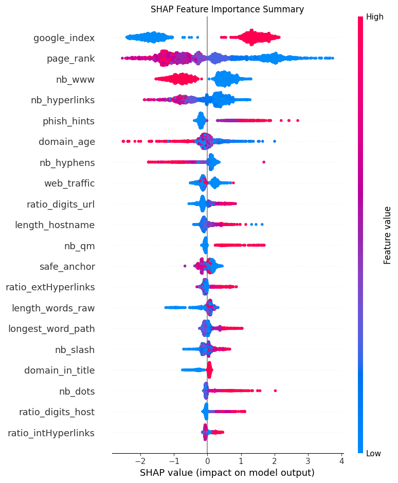
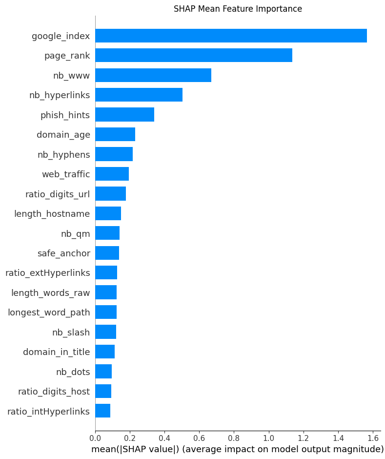

# Phishing Detection System

A machine learning system that detects phishing URLs using an ensemble of Gradient Boosting and LSTM models, SHAP explainability, and VirusTotal threat intelligence — served via a REST API.

---

## Table of Contents
- [Overview](#overview)
- [Architecture](#architecture)
- [Models & Results](#models--results)
- [Features Extracted](#features-extracted)
- [Project Structure](#project-structure)
- [Setup & Installation](#setup--installation)
- [Running the API](#running-the-api)
- [API Endpoints](#api-endpoints)
- [Example API Response](#example-api-response)
- [SHAP Explainability](#shap-explainability)
- [Adversarial Testing](#adversarial-testing)
- [Limitations & Future Work](#limitations--future-work)

---

## Overview

Phishing attacks remain one of the most common cybersecurity threats. This project builds an end-to-end phishing URL detection system that:

- Extracts 26 features from any raw URL (lexical, WHOIS, DNS)
- Trains a **Gradient Boosting Classifier (GBC)** on structured features
- Trains a **character-level LSTM** on raw URL strings
- Combines both into a **weighted ensemble**
- Explains predictions using **SHAP** (SHapley Additive exPlanations)
- Cross-checks URLs against **70+ antivirus engines** via VirusTotal API
- Serves everything through a **FastAPI REST API**

---

## Architecture

```
Raw URL Input
     │
     ├──► Lexical Feature Extractor (18 features)
     ├──► WHOIS Feature Extractor   (4 features)
     ├──► DNS Feature Extractor     (5 features)
     │         │
     │         ▼
     │    GBC Model ──────────────────────────┐
     │                                        │
     └──► Character Tokenizer                 ├──► Weighted Ensemble
               │                              │         │
               ▼                              │         ▼
          LSTM Model ────────────────────────┘    Risk Score (0-100%)
                                                       │
                                        ┌──────────────┤
                                        │              │
                                   VirusTotal     SHAP Explanation
                                   API Check      (Top 5 Features)
```

---

## Models & Results

### Performance Comparison

| Model    | Accuracy | Precision | Recall | F1 Score | AUC-ROC |
|----------|----------|-----------|--------|----------|---------|
| GBC      | 96.47%   | 96.23%    | 97.48% | 96.85%   | 99.47%  |
| LSTM     | 89.37%   | 88.73%    | 90.20% | 89.46%   | 95.70%  |
| Ensemble | **96.76%** | **96.44%** | **97.11%** | **96.77%** | 99.18% |

### Confusion Matrices

**GBC**
- True Positives: 1201 | False Negatives: 31
- True Negatives: 932  | False Positives: 47

**LSTM**
- True Positives: 1031 | False Negatives: 112
- True Negatives: 1012 | False Positives: 131

**Ensemble**
- True Positives: 1110 | False Negatives: 33
- True Negatives: 1102 | False Positives: 41

---

## Features Extracted

### Lexical Features (18)
| Feature | Description |
|---------|-------------|
| url_length | Total length of URL |
| domain_length | Length of domain name |
| path_length | Length of URL path |
| num_dots | Number of dots in URL |
| num_hyphens | Number of hyphens |
| num_underscores | Number of underscores |
| num_slashes | Number of forward slashes |
| num_digits | Number of digits |
| num_special_chars | Count of non-alphanumeric characters |
| has_ip | Whether URL uses IP address instead of domain |
| has_https | Whether URL uses HTTPS |
| has_at_symbol | Presence of @ symbol |
| has_double_slash | Presence of // in path |
| has_hyphen_in_domain | Hyphen in domain name |
| domain_entropy | Shannon entropy of domain string |
| subdomain_entropy | Shannon entropy of subdomain |
| num_subdomains | Number of subdomains |

### WHOIS Features (4)
| Feature | Description |
|---------|-------------|
| domain_age_days | Age of domain in days |
| expiration_days | Days until domain expires |
| whois_available | Whether WHOIS lookup succeeded |

### DNS Features (5)
| Feature | Description |
|---------|-------------|
| has_dns | Whether domain resolves |
| ip_count | Number of IP addresses |
| has_mx_record | Whether mail server exists |
| has_ns_record | Whether nameserver exists |
| ns_count | Number of nameservers |

---

## Project Structure

```
phishing-detection-system/
│
├── data/
│   ├── phishing.csv               # Kaggle dataset (pre-extracted features)
│   ├── dataset_phishing.csv       # URL dataset with raw URLs
│   └── verified_online.csv        # PhishTank verified phishing URLs
│
├── notebooks/
│   └── phishing_detection.ipynb   # Main Jupyter notebook
│
├── models/
│   ├── gbc_model.pkl              # GBC trained on Kaggle dataset
│   ├── gbc_new_model.pkl          # GBC trained on URL dataset
│   ├── lstm_model.keras           # Character-level LSTM model
│   ├── char2idx.pkl               # Character tokenizer
│   ├── feature_names.pkl          # Feature names (Kaggle)
│   └── feature_names_new.pkl      # Feature names (URL dataset)
│
├── api/
│   └── main.py                    # FastAPI application
│
├── results/
│   ├── gbc_confusion_matrix.png
│   ├── lstm_confusion_matrix.png
│   ├── ensemble_confusion_matrix.png
│   ├── shap_summary_plot.png
│   └── shap_bar_plot.png
│
├── .env                           # API keys (never pushed to GitHub)
├── .gitignore
└── README.md
```

---

## Setup & Installation

### Prerequisites
- Python 3.10+
- Anaconda

### Step 1 — Clone the repository
```bash
git clone https://github.com/SpoorthyM-2024/phishing-detection-system
cd phishing-detection-system
```

### Step 2 — Create and activate environment
```bash
conda create -n phishing-detector python=3.10
conda activate phishing-detector
```

### Step 3 — Install dependencies
```bash
pip install scikit-learn tensorflow keras shap
pip install python-whois dnspython requests beautifulsoup4
pip install fastapi uvicorn pandas numpy
pip install matplotlib seaborn jupyter notebook
pip install tldextract urllib3 python-dotenv
```

### Step 4 — Set up VirusTotal API key
Create a `.env` file in the project root:
```
VT_API_KEY=your_virustotal_api_key_here
```
Get a free API key at [virustotal.com](https://www.virustotal.com)

### Step 5 — Download datasets
Place the following in the `/data` folder:
- `phishing.csv` — [Kaggle Phishing Dataset](https://www.kaggle.com)
- `dataset_phishing.csv` — [Web Page Phishing Detection Dataset](https://www.kaggle.com/datasets/shashwatwork/web-page-phishing-detection-dataset)
- `verified_online.csv` — [PhishTank](https://www.phishtank.com/develop.php)

---

## Running the API

```bash
conda activate phishing-detector
cd api
uvicorn main:app --reload
```

API will be available at `http://127.0.0.1:8000`

Interactive docs at `http://127.0.0.1:8000/docs`

---

## API Endpoints

| Method | Endpoint | Description |
|--------|----------|-------------|
| GET | `/` | Health check |
| GET | `/health` | Model status |
| POST | `/analyze` | Quick analysis with risk score |
| POST | `/report` | Full detailed report |

---

## Example API Response

### POST /report
**Request:**
```json
{
  "url": "http://rapidpaws.com/wp-content/we_transfer/index2.php?email=/"
}
```

**Response:**
```json
{
  "url": "http://rapidpaws.com/wp-content/we_transfer/index2.php?email=/",
  "classification": "PHISHING",
  "risk_level": "HIGH",
  "risk_score": 88.49,
  "model_scores": {
    "gbc_confidence": 80.83,
    "lstm_confidence": 99.98,
    "ensemble_score": 88.49
  },
  "virustotal": {
    "malicious": 16,
    "suspicious": 0,
    "harmless": 0,
    "total_engines": 92,
    "vt_risk_score": 17.39
  },
  "top_5_features": [
    {"feature": "phish_hints", "impact": 1.3196, "direction": "phishing"},
    {"feature": "google_index", "impact": 1.1813, "direction": "phishing"},
    {"feature": "nb_hyperlinks", "impact": 0.4509, "direction": "phishing"},
    {"feature": "nb_qm", "impact": 0.4397, "direction": "phishing"},
    {"feature": "page_rank", "impact": 0.3244, "direction": "phishing"}
  ],
  "recommendation": "Do not visit this URL",
  "summary": "URL analyzed by GBC, LSTM and VirusTotal. Risk level is HIGH at 88.49%."
}
```

---

## SHAP Explainability

SHAP (SHapley Additive exPlanations) is used to explain why the model classifies a URL as phishing or legitimate. The top features driving predictions are:

| Feature | Phishing Signal |
|---------|----------------|
| google_index | Not indexed by Google → suspicious |
| page_rank | Low page rank → suspicious |
| nb_www | Missing www → suspicious |
| phish_hints | Keywords like "login", "verify", "secure" in URL |
| domain_age | Very new domain → suspicious |
| nb_hyphens | Many hyphens → suspicious |




---

## Adversarial Testing

The model was tested against common evasion techniques:

| Attack Type | Example | Result |
|-------------|---------|--------|
| URL shortener | bit.ly/3xampleURL | ✅ Detected (99.74%) |
| TinyURL | tinyurl.com/y4example | ✅ Detected (97.34%) |
| URL encoding | paypal%2Ecom/login | ✅ Detected (97.84%) |
| Homograph (I vs l) | paypaI.com/login | ✅ Detected (78.76%) |
| Subdomain trick | google.com.phishing-site.com | ✅ Detected (99.81%) |
| HTTPS phishing | secure-paypal-login.com | ✅ Detected (99.75%) |
| Encoded dots | www%2Egoogle%2Ecom | ❌ Missed (1.64%) |
| Subtle homograph | arnazon.com | ❌ Missed (26.60%) |

---

## Limitations & Future Work

### Current Limitations
- **URL encoded domains** — `www%2Egoogle%2Ecom` bypasses detection because encoded dots resemble a clean short URL
- **Subtle homograph attacks** — `arnazon.com` (rn vs m) is not caught as the model has no brand awareness
- **GBC relies on pre-extracted features** — live URLs without dataset features fall back to default values
- **VirusTotal free tier** — limited to 500 requests/day

### Future Work
- Add brand similarity checking using edit distance against a known brands list
- URL decode before feature extraction to handle encoded characters
- Train on larger dataset (500k+ URLs) for better LSTM generalization
- Add browser extension integration
- Deploy to cloud (AWS/GCP) for public access

---

## Tech Stack

| Component | Tool |
|-----------|------|
| Language | Python 3.10 |
| ML Models | scikit-learn, TensorFlow/Keras |
| Explainability | SHAP |
| URL Features | python-whois, dnspython, tldextract |
| Threat Intel | VirusTotal API |
| API Framework | FastAPI + Uvicorn |
| Data | pandas, numpy |
| Visualization | matplotlib, seaborn |

---

## Author
Spoorthy Madduri
Built as a portfolio project demonstrating end-to-end ML system design, from raw feature engineering to deployed REST API.
